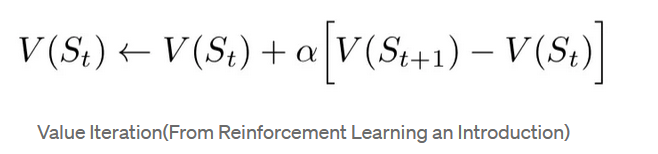
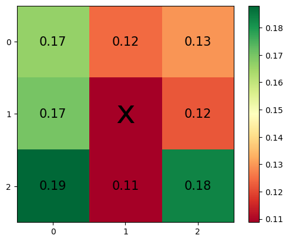
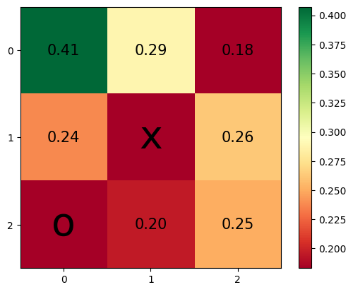
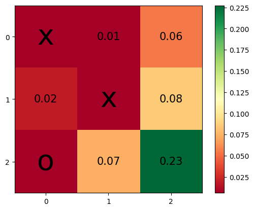
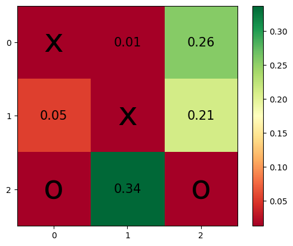
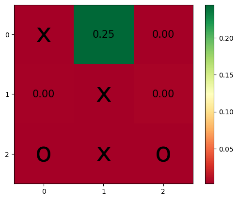
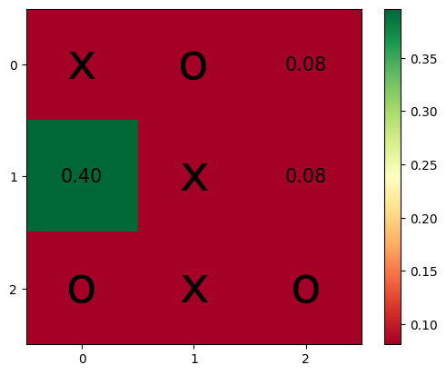
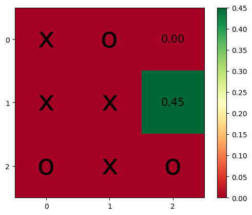
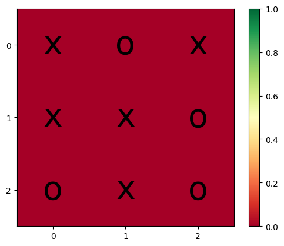

# tic-tac-toe
Applying RL to play tic-tac-toe

This work builds upon this source [here](https://towardsdatascience.com/reinforcement-learning-implement-tictactoe-189582bea542)

### RL formula


### TODO:
- [x] Added player 2 policy
- [x] Improved human vs computer 
- [x] Improved logging
- [x] Performed action space analysis

-------------------------------
### The Ultimate Draw:

<div class="image-container">
    
   
  
    
  
    
  
  
  
  
</div>

-------------------------------

### Most Played Endings

``` text
This position was played 1549 times!
  p1: x  p2: o
   
   x|o|x
   -+-+-
   o|x|x
   -+-+-
   o|x|o
```

``` text
This position was played 1490 times!
  p1: x  p2: o
   
   x|x|o
   -+-+-
   o|x|x
   -+-+-
   x|o|o
```

``` text
This position was played 1483 times!
  p1: x  p2: o
   
   x|o|x
   -+-+-
   x|x|o
   -+-+-
   o|x|o
```


