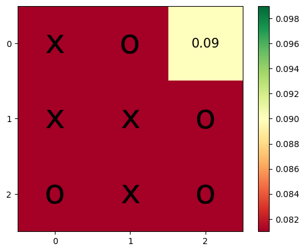

# tic-tac-toe
Applying RL to play tic-tac-toe

This work builds upon this source [here](https://towardsdatascience.com/reinforcement-learning-implement-tictactoe-189582bea542)

### RL formula

### TODO:
- [x] Added player 2 policy
- [x] Improved human vs computer 
- [x] Improved logging
- [x] Perform analysis

-------------------------------

<!DOCTYPE html>
<html>
<head>

</head>
<body>

  
    
  
    
  
    
  
  
  
  

</body>
</html>

